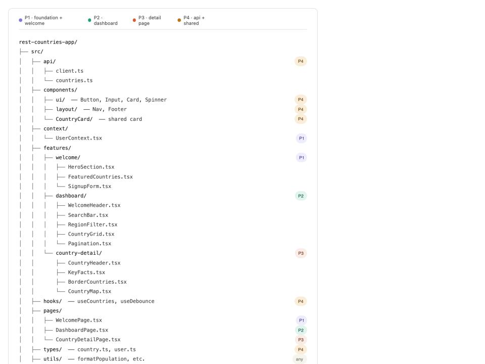
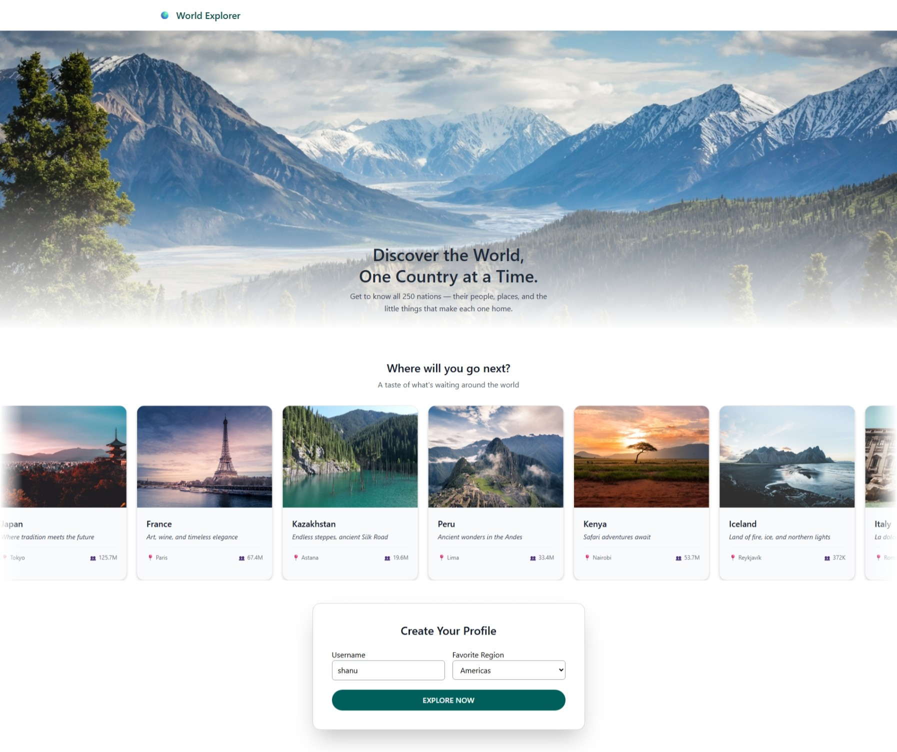
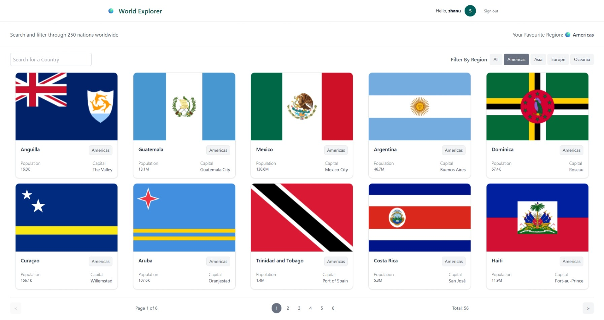
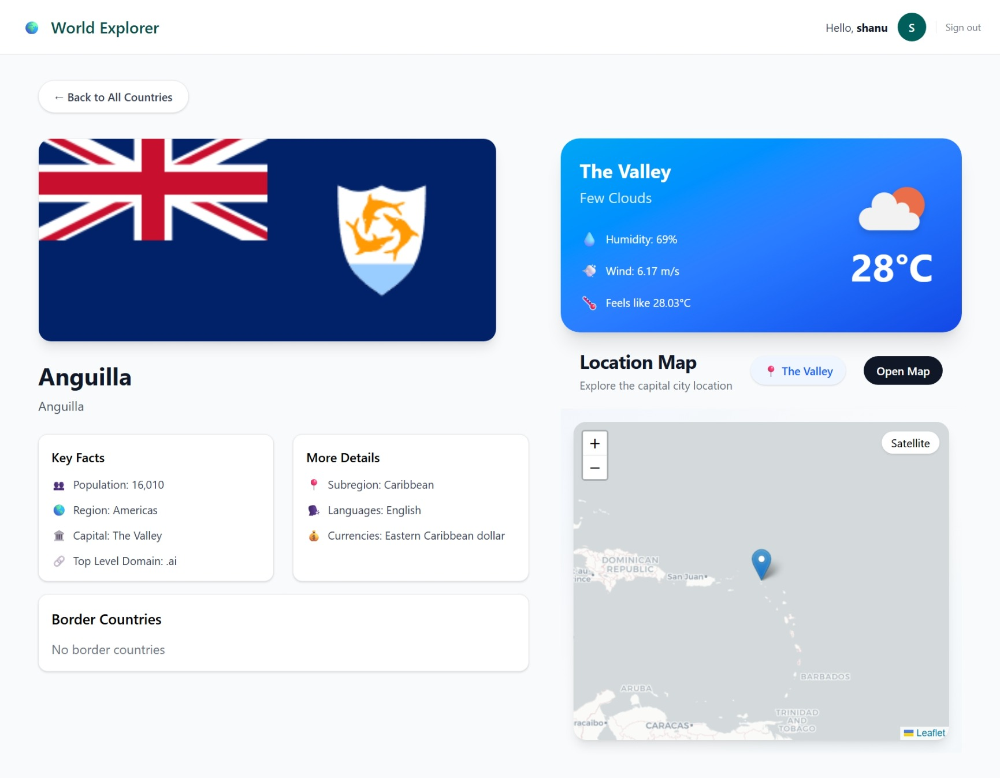

# REST Countries Explorer Pro 

This is React + TypeScript web application where users can explore countries, view country details, filter/search/sort countries, save favorites, compare countries, weather app and view country locations on a map

## Features
* Search countries by name
* Filter countries by region
* Country details page
* Border countries navigation
* Favorites Regions
* Loading and error UI
* Responsive design
* Country map on details page
* Weather detail about the captial
* Login/Logout for the user

## Technologies Used:
- React
- TypeScript
- React Router DOM
- Tailwind CSS
- REST Countries API
- Context API
- Custom hooks
- localStorage
- Leaflet / React Leaflet for maps
- Netlify for deployment


## Development Process
- Planning
- Create project structure
- Set up routes
- Build API service and types
- Build welcome page
- Add search, filter, and sort
- Build country details page
- Add border country navigation
- Add map section
- Add favorites
- Testing
- GitHub collaboration
- Deployment using Netlify
- Presentation 

## Project Structure


## Screenshot




## Git Workflow: Pulling Latest Changes from Main into a Feature Branch

Below are the steps for updating your local feature branch with the latest changes from the main branch.

### Update Your Local main Branch
  - git checkout main
  - git fetch origin
  - git pull origin main
This ensures your local main matches the latest remote origin/main.

### Switch to Your Feature Branch

  - git checkout <branch-name>
  - Replace <branch-name> with the name of your feature branch.

### Rebase Your Branch onto the Latest origin/main

  - git rebase origin/main
  - Rebasing applies your branch’s commits on top of the newest main commits, keeping history clean.

### Resolve Any Merge Conflicts
If conflicts appear during rebase:
    - git add .
    - git rebase --continue
Repeat until the rebase completes.

### Push Your Updated Branch
  - If your branch was not rebased before, a normal push works:
      git push origin <branch-name>
  - If you did rebase, you must force‑push safely:
      git push origin <branch-name> --force-with-lease
      --force-with-lease ensures you don’t overwrite others’ work.

### Summary
  - Update local main
  - Switch to feature branch
  - Rebase onto origin/main
  - Resolve conflicts
  - Push (force‑with‑lease if rebased)
This is the cleanest and safest workflow for keeping your feature branch up to date with main.

#### Flight API Example Response:

```
{
  "flight_status": "active",
  "departure": {
    "airport": "Delhi Airport",
    "scheduled": "2026-05-07T10:00:00"
  },
  "arrival": {
    "airport": "JFK Airport",
    "estimated": "2026-05-07T18:30:00"
  }
}
```
## Reflection
  ### Challenges
    - deployement challenge: Not able to deploy the application in Github Pages due to react/vite json configuration which worked in local.
    - Merge Conflcts issue on the same file, took more time than we expected.
    - Pagination: Current Page number was randomly updated after clicking any page and try to click next page. 
      
  ### Solution
    - We switched to Netlify where we tried to deploy, got typescript error on missing type and unused variables. Fixed and redeployed in Netlify successfully 
    - Followed the steps specified in Git Workflow section to resolve the merge conflicts.
    - On click of any page number, the value read from element is being passed as string, converted the value as number before passing to the custom hook.